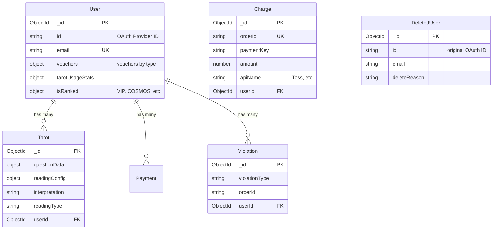

# 데이터베이스 ERD / Database ERD / データベース ERD

> MongoDB 스키마 설계 및 인덱싱 전략 / MongoDB Schema Design & Indexing / MongoDB スキーマ設計とインデックス戦略

> 공개 프론트엔드 코드는 질문/리딩 payload를 opaque 배열 포맷으로 전송하며,  
> 서버에서만 실제 처리 구조로 복원합니다.  
> Public frontend code sends question/reading payloads in an opaque array format, and only the server restores the processing shape.  
> 公開フロントエンドコードは質問/リーディング payload を opaque 配列形式で送信し、実処理構造への復元はサーバー側のみで行います。

<br>

---

## 한눈에 보기 / Overview / 概要

<table>
<tr>
<td width="33%">

### 한국어

| 항목          | 내용                                                    |
| ------------- | ------------------------------------------------------- |
| **DB**        | MongoDB (NoSQL)                                         |
| **컬렉션**    | User, Tarot, GuestTarot, Charge, Violation, DeletedUser |
| **특징**      | TTL Index, Redis Lock                                   |
| **관계**      | 1:N (User → Tarot/Payment)                              |
| **보관 기간** | 데이터 유형별 자동 삭제                                 |

</td>
<td width="33%">

### English

| Item            | Details                                                 |
| --------------- | ------------------------------------------------------- |
| **DB**          | MongoDB (NoSQL)                                         |
| **Collections** | User, Tarot, GuestTarot, Charge, Violation, DeletedUser |
| **Features**    | TTL Index, Redis Lock                                   |
| **Relations**   | 1:N (User → Tarot/Payment)                              |
| **Retention**   | Auto-delete by data type                                |

</td>
<td width="33%">

### 日本語

| 項目             | 詳細                               |
| ---------------- | ---------------------------------- |
| **DB**           | MongoDB (NoSQL)                    |
| **コレクション** | User, Tarot, Payment, Violation 等 |
| **特徴**         | TTL Index, Redis Lock              |
| **関係**         | 1:N (User → Tarot/Payment)         |
| **保管期間**     | データ型別自動削除                 |

</td>
</tr>
</table>

<br>

---

## 컬렉션 개요 / Collections / コレクション概要

<table>
<tr>
<td width="33%">

#### 한국어

| 컬렉션          | 용도        | 주요 필드                                 | TTL       |
| --------------- | ----------- | ----------------------------------------- | --------- |
| **User**        | 사용자      | email, vouchers, isRanked                 | 유휴 시   |
| **Tarot**       | 서비스 기록 | questionData, interpretation, readingType | 일정 기간 |
| **Charge**      | 결제        | orderId, paymentKey, amount, apiName      | 수단별    |
| **Violation**   | 위반        | violationType, orderId                    | -         |
| **DeletedUser** | 탈퇴        | email, deleteReason                       | -         |

</td>
<td width="33%">

#### English

| Collection      | Purpose        | Key Fields                   | TTL          |
| --------------- | -------------- | ---------------------------- | ------------ |
| **User**        | User           | email, vouchers, isRanked    | Idle         |
| **Tarot**       | Service Record | questionData, interpretation | After Period |
| **Charge**      | Payment        | orderId, amount, apiName     | By Method    |
| **Violation**   | Violation      | violationType, orderId       | -            |
| **DeletedUser** | Deleted        | email, deleteReason          | -            |

</td>
<td width="33%">

#### 日本語

| コレクション    | 用途         | 主要フィールド                            | TTL        |
| --------------- | ------------ | ----------------------------------------- | ---------- |
| **User**        | ユーザー     | email, vouchers, isRanked                 | アイドル時 |
| **Tarot**       | サービス履歴 | questionData, interpretation, readingType | 一定期間後 |
| **Charge**      | 決済         | orderId, paymentKey, amount, apiName      | 手段別     |
| **Violation**   | 違反         | violationType, orderId                    | -          |
| **DeletedUser** | 退会         | email, deleteReason                       | -          |

</td>
</tr>
</table>

<br>

---

## 인덱싱 전략 / Indexing Strategy / インデックス戦略

### Public Exposure Note

- Frontend payload keys are intentionally abstracted (`a[]`, `b[]`) for portfolio-safe sharing.
- Domain-specific semantic mapping is retained on backend normalization only.

<table>
<tr>
<td width="33%">

#### 한국어

| 인덱스 타입        | 용도        | 예시                        |
| ------------------ | ----------- | --------------------------- |
| **Unique Index**   | 중복 방지   | `{ email: 1 }`              |
| **Compound Index** | 쿼리 최적화 | `{ userId: 1, orderId: 1 }` |
| **TTL Index**      | 자동 삭제   | `{ createdAt: 1 }`          |
| **Partial Filter** | 조건부      | Payment method-based        |

</td>
<td width="33%">

#### English

| Index Type         | Purpose            | Example                     |
| ------------------ | ------------------ | --------------------------- |
| **Unique Index**   | Prevent Duplicate  | `{ email: 1 }`              |
| **Compound Index** | Query Optimization | `{ userId: 1, orderId: 1 }` |
| **TTL Index**      | Auto-delete        | `{ createdAt: 1 }`          |
| **Partial Filter** | Conditional        | Payment method-based        |

</td>
<td width="33%">

#### 日本語

| インデックスタイプ | 用途         | 例                          |
| ------------------ | ------------ | --------------------------- |
| **Unique Index**   | 重複防止     | `{ email: 1 }`              |
| **Compound Index** | クエリ最適化 | `{ userId: 1, orderId: 1 }` |
| **TTL Index**      | 自動削除     | `{ createdAt: 1 }`          |
| **Partial Filter** | 条件付き     | Payment method-based        |

</td>
</tr>
</table>

<br>

---

## 데이터 보관 기간 / Data Retention / 데이터保管期間

<table>
<tr>
<td width="33%">

#### 한국어

| 데이터 유형        | 보관 정책         | 이유     |
| ------------------ | ----------------- | -------- |
| User (유휴)        | 일정 기간 후 삭제 | 스토리지 |
| Tarot              | TTL Index         | GDPR     |
| Payment (일반)     | 장기 보관         | 법적     |
| Payment (가상계좌) | 중기 보관         | 법적     |
| Payment (구독)     | 단기 보관         | 만료 후  |
| Payment (미완료)   | 즉시 삭제         | 임시     |

</td>
<td width="33%">

#### English

| Data Type              | Policy      | Reason       |
| ---------------------- | ----------- | ------------ |
| User (Idle)            | Auto-delete | Storage      |
| Tarot                  | TTL Index   | GDPR         |
| Payment (General)      | Long-term   | Legal        |
| Payment (Virtual)      | Mid-term    | Legal        |
| Payment (Subscription) | Short-term  | After expiry |
| Payment (Pending)      | Immediate   | Temporary    |

</td>
<td width="33%">

#### 日本語

| データタイプ       | ポリシー       | 理由       |
| ------------------ | -------------- | ---------- |
| User (アイドル)    | 一定期間後削除 | ストレージ |
| Tarot              | TTL Index      | GDPR       |
| Payment (一般)     | 長期保管       | 法的       |
| Payment (仮想口座) | 中期保管       | 法的       |
| Payment (サブスク) | 短期保管       | 期限切れ後 |
| Payment (未完了)   | 即時削除       | 一時       |

</td>
</tr>
</table>

<br>

---

## Redis 캐시·락·큐 / Redis Cache, Lock & Queue

| 키 패턴                                 | 용도                | TTL      |
| --------------------------------------- | ------------------- | -------- |
| `user:${userId}`                        | 유저 정보 캐싱      | 3600s    |
| `cache:tarot:${userId}`                 | 타로 기록 캐싱      | 3600s    |
| `cache:limit:${productId}:${userId}`    | 상품 구매 제한 캐싱 | 3600s    |
| `payment:progress:${userId}:${orderId}` | 결제 진행 중복 방지 | 60~3600s |
| `refund:count:${orderId}`               | 환불 요청 카운트    | 3600s    |
| `refund:vouchers:${orderId}`            | 환불용 바우처 임시  | 3600s    |
| `webhook:${orderId}:${status}`          | 웹훅 중복 처리 방지 | 3600s    |
| `auth:temp:${code}`                     | 앱 코드→토큰 교환   | 단기     |

**Bull 큐:** `haiku-queue` (모델2), `sonnet-queue` (모델3/4) — Redis 기반.

<br>

---

## 트랜잭션 처리 / Transaction Processing / トランザクション処理

<table>
<tr>
<td width="50%">

### 한국어

**1. MongoDB 트랜잭션**

```
세션 시작 → 복수 작업 실행 →
원자적 커밋 → 세션 종료
```

**용도:** 데이터 일관성 보장

**적용 도메인:**

- 타로 해석 생성 + 이용권 차감
- 결제 완료 + 바우처 지급
- 환불 처리 + 바우처 회수

**2. Redis Lock**

```
Lock 획득 → API 호출 →
DB 저장 → 처리 → Lock 해제
```

**용도:** 중복 요청 방지

**적용 도메인:**

- 결제 API 호출 전 중복 차단
- 웹훅 중복 처리 방지
- 동시 환불 요청 제어

</td>
<td width="50%">

### English

**1. MongoDB Transaction**

```
Start Session → Execute Operations →
Atomic Commit → End Session
```

**Use:** Data consistency

**Applied Domains:**

- Tarot reading + Voucher deduction
- Payment completion + Voucher issuance
- Refund processing + Voucher reclaim

**2. Redis Lock**

```
Acquire Lock → API Call →
Save DB → Process → Release Lock
```

**Use:** Prevent duplicates

**Applied Domains:**

- Block duplicate payment via `payment:progress` lock
- Prevent duplicate webhook via `webhook:${orderId}:${status}`
- Control concurrent refunds via `refund:count`, `refund:vouchers`

</td>
</tr>
<tr>
<td colspan="2">

### 日本語

**1. MongoDB トランザクション**

```
セッション開始 → 複数操作実行 →
原子的コミット → セッション終了
```

**用途:** データ一貫性保証

**適用ドメイン:**

- タロット解釈生成 + 利用券減額
- 決済完了 + バウチャー支給
- 払い戻し処理 + バウチャー回収

**2. Redis Lock**

```
Lock取得 → API呼び出し →
DB保存 → 処理 → Lock解放
```

**用途:** 重複リクエスト防止

**適用ドメイン:**

- 決済 API 呼び出し前の重複遮断
- ウェブフック重複処理防止
- 同時払い戻しリクエスト制御

</td>
</tr>
</table>

<br>

---

## ERD 다이어그램 / ERD Diagram / ERD ダイアグラム



---

<details>
<summary><b>상세 스키마 정보 보기 / Detailed Schema Info / 詳細スキー마 정보</b></summary>

## 컬렉션 상세 / Collection Details / コレクション詳細

<table>
<tr>
<td width="33%">

### 한국어

#### 1. User (사용자)

**주요 필드:**

| 필드명            | 타입   | 설명                       |
| ----------------- | ------ | -------------------------- |
| `id`              | String | OAuth Provider ID (고유값) |
| `email`           | String | 이메일 (Unique Index)      |
| `vouchers`        | Object | 보유 이용권                |
| `tarotUsageStats` | Object | 타로 사용 통계             |
| `isRanked`        | Object | 회원 등급 (VIP 등)         |
| `counsleeInfo`    | Mixed  | 내담자 정보                |

**인덱스:**

```javascript
{
  email: 1;
}
unique;
```

---

#### 2. Tarot (서비스 기록)

**주요 필드:**

| 필드명           | 타입     | 설명             |
| ---------------- | -------- | ---------------- |
| `questionData`   | Object   | 사용자 질문 정보 |
| `readingConfig`  | Object   | 해석 설정        |
| `interpretation` | String   | 결과 (JSON)      |
| `readingType`    | String   | 타입             |
| `userId`         | ObjectId | User 참조        |
| `sessionId`      | String   | 중복 방지용      |

**인덱스:**

```javascript
// 인덱스 없음 (보안상 간소화)
```

---

#### 3. Payment (결제 기록)

**주요 필드:**

| 필드명          | 타입     | 설명                    |
| --------------- | -------- | ----------------------- |
| `orderId`       | String   | 주문 번호               |
| `paymentKey`    | String   | PG 결제 키              |
| `purchaseToken` | String   | 인앱 영수증 토큰        |
| `amount`        | Number   | 결제 금액               |
| `apiName`       | String   | PG사/스토어 ("Toss" 등) |
| `userId`        | ObjectId | User 참조               |

**인덱스:**

```javascript
{ userId: 1, orderId: 1 } unique
```

---

#### 4. Violation (위반 기록)

**주요 필드:**

| 필드명              | 타입     | 설명      |
| ------------------- | -------- | --------- |
| `violationType`     | String   | 위반 유형 |
| `orderId`           | String   | 관련 주문 |
| `remainingQuantity` | String   | 남은 수량 |
| `userId`            | ObjectId | User 참조 |

**용도:** 환불 패턴 추적

---

#### 5. DeletedUser (삭제 사용자)

**주요 필드:**

| 필드명         | 타입   | 설명          |
| -------------- | ------ | ------------- |
| `id`           | String | 원래 OAuth ID |
| `email`        | String | 이메일        |
| `deleteReason` | String | 탈퇴 사유     |

**용도:** 재가입 제한

</td>
<td width="33%">

### English

#### 1. User

**Key Fields:**

| Field             | Type   | Description       |
| ----------------- | ------ | ----------------- |
| `id`              | String | OAuth Provider ID |
| `email`           | String | Email (Unique)    |
| `vouchers`        | Object | Vouchers owned    |
| `tarotUsageStats` | Object | Tarot usage stats |
| `isRanked`        | Object | Membership tier   |
| `counsleeInfo`    | Mixed  | Counslee info     |

**Indexes:**

```javascript
{
  email: 1;
}
unique;
```

---

#### 2. Tarot (Service Record)

**Key Fields:**

| Field            | Type     | Description        |
| ---------------- | -------- | ------------------ |
| `questionData`   | Object   | User question data |
| `readingConfig`  | Object   | Reading config     |
| `interpretation` | String   | Result (JSON)      |
| `readingType`    | String   | Type               |
| `userId`         | ObjectId | User reference     |
| `sessionId`      | String   | Duplicate prevent  |

**Indexes:**

```javascript
// No indexes (simplified for security)
```

---

#### 3. Payment (Payment Record)

**Key Fields:**

| Field           | Type     | Description                      |
| --------------- | -------- | -------------------------------- |
| `orderId`       | String   | Order ID                         |
| `paymentKey`    | String   | PG payment key                   |
| `purchaseToken` | String   | In-app receipt token             |
| `amount`        | Number   | Payment amount                   |
| `apiName`       | String   | PG/Store provider ("Toss", etc.) |
| `userId`        | ObjectId | User reference                   |

**Indexes:**

```javascript
{ userId: 1, orderId: 1 } unique
```

---

#### 4. Violation

**Key Fields:**

| Field            | Type     | Description    |
| ---------------- | -------- | -------------- |
| `violationType`  | String   | Violation type |
| `orderId`        | String   | Related order  |
| `refundedAmount` | String   | Refund amount  |
| `userId`         | ObjectId | User reference |

**Purpose:** Track refund patterns

---

#### 5. DeletedUser

**Key Fields:**

| Field          | Type   | Description       |
| -------------- | ------ | ----------------- |
| `id`           | String | Original OAuth ID |
| `email`        | String | Email             |
| `deleteReason` | String | Delete reason     |

**Purpose:** Prevent re-registration

</td>
<td width="33%">

### 日本語

#### 1. User (ユーザー)

**主要フィールド:**

| フィールド名      | タイプ | 説明                  |
| ----------------- | ------ | --------------------- |
| `id`              | String | OAuth Provider ID     |
| `email`           | String | メール (Unique Index) |
| `vouchers`        | Object | 保有利用券            |
| `tarotUsageStats` | Object | タロット使用統計      |
| `isRanked`        | Object | 会員等級              |
| `counsleeInfo`    | Mixed  | 相談者情報            |

**インデックス:**

```javascript
{
  email: 1;
}
unique;
```

---

#### 2. Tarot (サービス記録)

**主要フィールド:**

| フィールド名     | タイプ   | 説明             |
| ---------------- | -------- | ---------------- |
| `questionData`   | Object   | ユーザー質問情報 |
| `readingConfig`  | Object   | 解釈設定         |
| `interpretation` | String   | 結果 (JSON)      |
| `readingType`    | String   | タイプ           |
| `userId`         | ObjectId | User 参照        |
| `sessionId`      | String   | 重複防止用       |

**インデックス:**

```javascript
// インデックスなし（セキュリティのため簡略化）
```

---

#### 3. Payment (決済記録)

**主要フィールド:**

| フィールド名    | タイプ   | 説明                       |
| --------------- | -------- | -------------------------- |
| `orderId`       | String   | 注文番号                   |
| `paymentKey`    | String   | PG 決済キー                |
| `purchaseToken` | String   | インアプリレシートトークン |
| `amount`        | Number   | 決済金額                   |
| `apiName`       | String   | PG/ストア ("Toss" など)    |
| `userId`        | ObjectId | User 参照                  |

**インデックス:**

```javascript
{ userId: 1, orderId: 1 } unique
```

---

#### 4. Violation (違反記録)

**主要フィールド:**

| フィールド名     | タイプ   | 説明         |
| ---------------- | -------- | ------------ |
| `violationType`  | String   | 違反タイプ   |
| `orderId`        | String   | 関連注文     |
| `refundedAmount` | String   | 払い戻し数量 |
| `userId`         | ObjectId | User 参照    |

**用途:** 払い戻しパターン追跡

---

#### 5. DeletedUser (削除ユーザー)

**主要フィールド:**

| フィールド名   | タイプ | 説明          |
| -------------- | ------ | ------------- |
| `id`           | String | 元の OAuth ID |
| `email`        | String | メール        |
| `deleteReason` | String | 退会理由      |

**用途:** 再加入制限

</td>
</tr>
</table>

</details>

<br>

---

<div align="center">

**코드 위치:** `back/src/domains/*/models/*.js`, `back/src/cache/cacheClient.js`, `back/src/queue/tarotQueue.js`

[← 문서 홈으로](../README.md)

</div>
